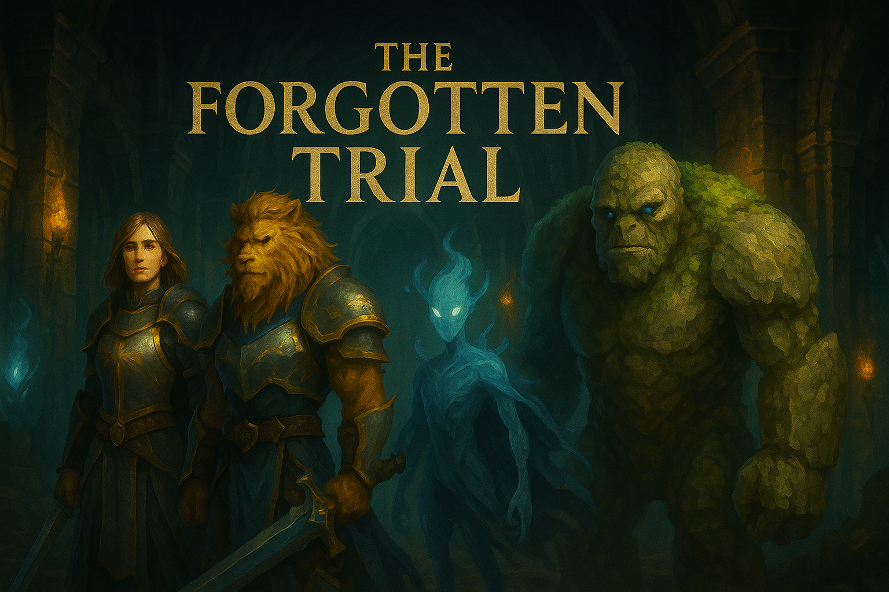

# **The Forgotten Trial**  
*A Tactical RPG Mystery by Phoenix Gold Gaming Studios*

---

## 🧩 Overview

**The Forgotten Trial** is a single-player, 3D tactical RPG mystery set deep within a cursed, long-abandoned fortress dungeon.
Your party awakens with no memory. No clues—except the voice of an unpredictable AI that whispers fragments of truth.

Guide your team through **turn-based combat**, **exploration**, and a **dynamic AI-driven narrative** where every playthrough is a different tale of memory, betrayal, and escape.

---

## ⚔️ Features

* 🎯 **Turn-Based Tactical Combat**
  Grid-based battles inspired by genre classics like *Fire Emblem* and *Tactics Ogre*.

* 🧠 **AI-Powered Narrative System**
  A cryptic AI generates hallucinations, memory fragments, and ghostly dialogues that shift with each playthrough.

* 👥 **Party Management**
  Control a diverse team of 1–4 characters. Each has their own mysterious past, evolving personalities, and trust-based reactions to your decisions.

* 🕵️ **Mystery-Driven Exploration**
  Discover lost knowledge, unlock scattered memories, and determine who you can trust. Not everyone may be what they seem.

* 🎮 **Keyboard/Mouse + Controller Support**
  Designed with accessible controls and smooth UX for all players.

* ✨ **Stylized Presentation & Immersive Audio**
  Featuring polished UI/UX, low-poly fantasy visuals, and ambient dungeon audio.

---

## 🛠️ Getting Started

1. Clone or download the repository.
2. Open `TheForgottenTrial.uproject` using **Unreal Engine 5.5.4**
3. Press **Play** from the Main Menu to begin your journey.
4. Explore, fight, remember… and escape.

---

## 👨‍💻 Credits

**Design & Development**
Trevor Hicks — Programmer, UX/UI Designer

**Built With**
Unreal Engine 5.5.4

---

## 🌐 About the Project

**The Forgotten Trial** is a passion-driven indie game inspired by beloved tactical RPGs and mystery storytelling.
The project’s core goal is to deliver a **unique and replayable experience**, shaped by choice, consequence, and cryptic AI narration.

Each decision brings you closer to the truth… or further from it.

---

## 📬 Contact

Questions, feedback, or collaboration requests?
🌐 [Portfolio](https://phoenixgoldz.github.io/)
✉️ Trevor Hicks (Phoenix Gold Gaming Studios)
